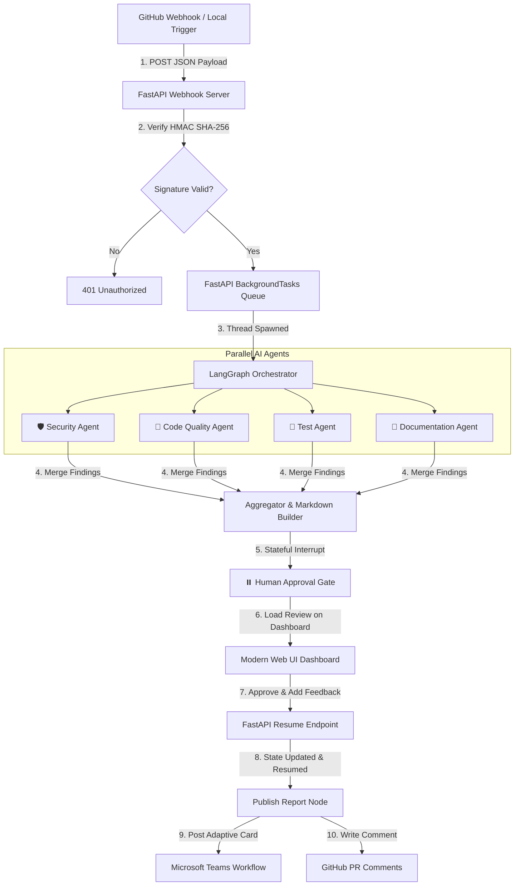

# 🤖 AI-Agent Automated Code Review Pipeline (LangGraph & FastAPI)

An automated code review pipeline designed to execute immediate multi-dimensional analysis on Pull Requests as soon as they are opened. To balance speed, accuracy, and security, it includes a **Human-in-the-Loop Approval Gate** using LangGraph stateful interrupts, ensuring no comments or reviews are posted publicly without your explicit authorization.

## 🏗️ Architecture & Flow



### 🧠 Core Components
1. **FastAPI Web Server**: Serves a highly optimized single-page web dashboard, handles secure GitHub webhook POSTs, validates HMAC SHA-256 payload signatures, and exposes REST endpoints to trigger or approve pipeline jobs.
2. **LangGraph Stateful Orchestration**: Configures a directed acyclic graph containing parallel worker nodes representing 4 specialized AI review agents, an aggregator node, a persistent `MemorySaver` checkpoint interrupt, and a publisher node.
3. **Parallel AI Agents**:
   - **🛡️ Security Agent**: Scans for OWASP Top 10 flaws, directory traversal, hardcoded credentials, and unsafe code execution blocks (`eval`/`exec`).
   - **📐 Code Quality & PEP-8 Agent**: Evaluates style guidelines, cognitive complexity, magic numbers, and refactoring possibilities.
   - **🧪 QA & Test Agent**: Scans for test coverage gaps and drafts ready-to-copy unit test suites using `pytest`.
   - **📝 Documentation Agent**: Identifies missing PEP-257 docstrings in classes/methods and assesses inline comment clarity.
4. **Mock Execution Engine**: Allows the entire system to run fully offline without any configuration, generating realistic contextual feedback based on the supplied diff content.

---

## ⚡ Quick Start (Local Setup)

### 1. Requirements
Ensure you have **Python 3.10+** and the **`uv` package manager** installed.

### 2. Install Dependencies & Run
Initialize the environment and launch the development server using:
```bash
# Sync and install virtual environment
uv sync

# Run the pipeline server
uv run run.py
```

### 3. Open the Dashboard
Navigate your browser to:
**[http://127.5.0.1:8000](http://127.5.0.1:8000)**

You will be greeted by a premium dark-themed dashboard where you can:
- **Simulate PR reviews**: Click **"Simulate PR Review"**, choose a preloaded code diff template (OWASP security leak, complex nested logic, or messy pep-8 style), and watch the parallel agents compile results.
- **Act as the Human Gate**: Inspect reports side-by-side, add reviewer feedback, and click **"Approve & Publish"** or **"Reject"** to resume the LangGraph execution.
- **Configure Models**: Swap between the Offline Mock engine, OpenAI, Gemini, or Claude models, and hook up Microsoft Teams webhook URLs at runtime.

---

## 🔒 Security Hardening (Production-Ready)

1. **GitHub Signature Verification**:
   GitHub webhook signatures are verified using HMAC-SHA256 signature matching against a private shared secret token, preventing spoofing attempts:
   ```python
   def verify_signature(payload, signature, secret):
       expected = hmac.new(secret.encode(), payload, hashlib.sha256).hexdigest()
       return hmac.compare_digest(expected, signature)
   ```
2. **10-Second Webhook Limits**:
   FastAPI spawns the LangGraph execution in a separate background thread pool utilizing `BackgroundTasks`. The webhook endpoint receives the payload, schedules the task, and returns a `200 OK` response in **under 2 milliseconds**, fully avoiding duplicate reviews triggered by GitHub's 10-second request timeout retry policy.
3. **Containerized Permissions (Docker)**:
   For remote cloud deployments, it is recommended to compile the app into a minimal container and execute as a non-privileged user:
   ```dockerfile
   FROM python:3.11-slim
   WORKDIR /app
   COPY . .
   RUN pip install uv && uv pip install --system -r pyproject.toml
   USER nobody
   ```

---

## 📈 Scaling to Organization Level

When migrating from a personal setup to an enterprise organization deployment:
1. **GitHub App Installation Scope**: Change your GitHub App installation from "Only select repositories" to "All repositories".
2. **Asynchronous Scaling (AWS)**: 
   - Deploy the FastAPI container on **AWS ECS Fargate**.
   - Move the in-memory checkpointer to **RDS PostgreSQL** to persist LangGraph states across server container restarts.
   - For high-volume enterprise teams, queue webhook events through **AWS ElastiCache for Redis** backed by Celery workers to handle heavy concurrent spikes.
